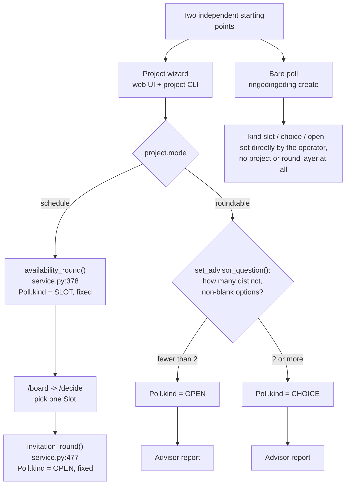
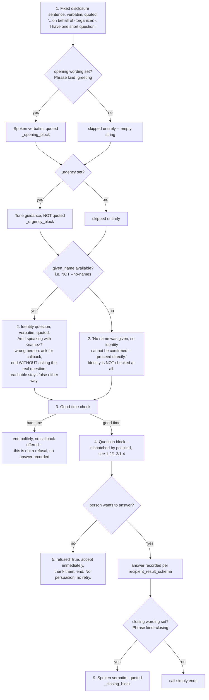
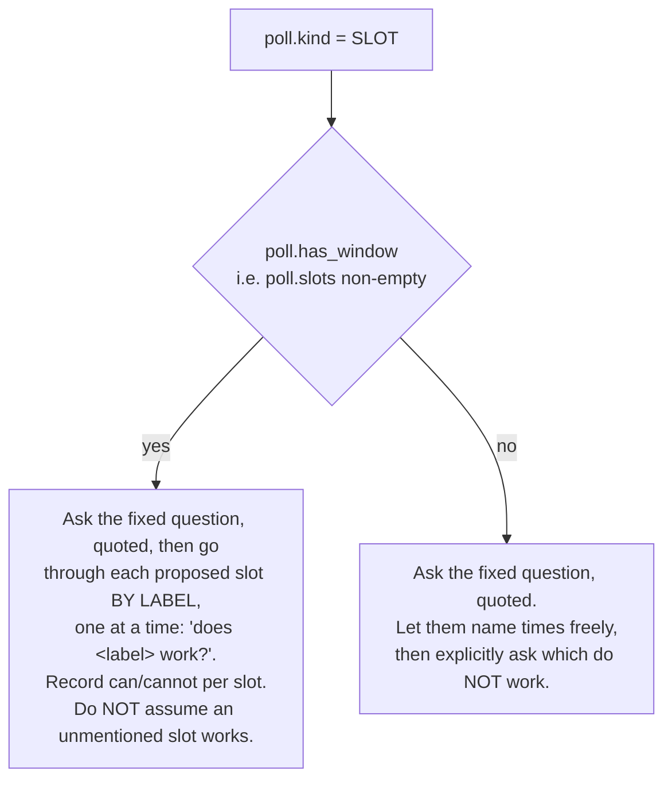
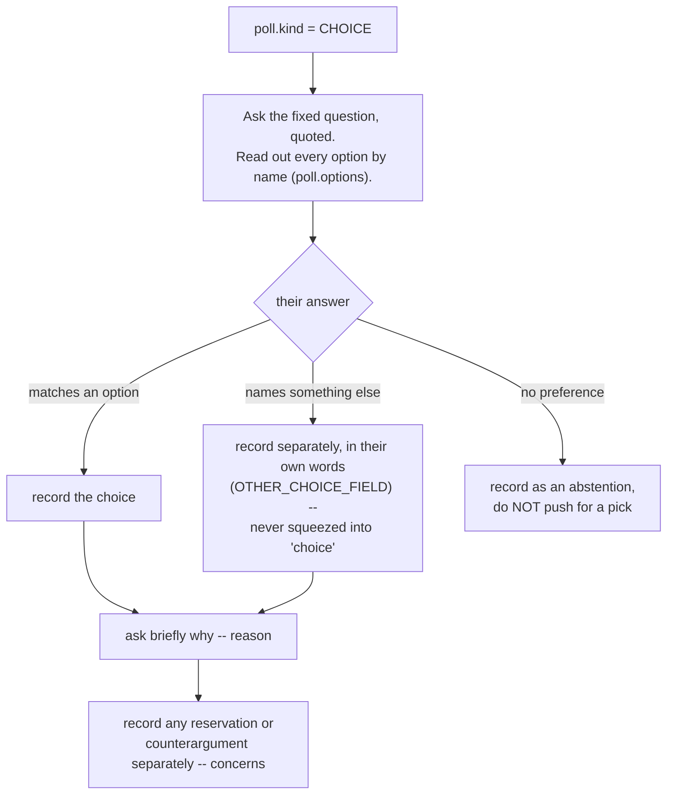
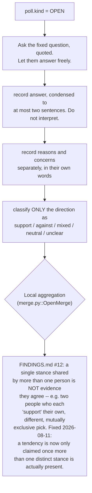

# CONVERSATION-TREE.md — every branch the task text can take, and every setting's fate

> This document answers one question precisely: **for a given call, what does the `task` free
> text actually tell the voice agent to do, node by node** — and, just as importantly, **which
> of Ringedingeding's user-configurable settings do NOT reach that text at all.** Every node
> below is tagged with the exact function and file:line in `ringedingeding/schemas.py` that
> produces it, so a change to the code is a change to a specific, findable line here.
>
> The central deliverable is the **coverage table** in §5. Read that first if you only have one
> question: *"does setting X land in the prompt?"*
>
> Named `CONVERSATION-TREE.md`, matching `hungrycall/CONVERSATION-TREE.md` (the sibling this
> document was explicitly asked to follow the pattern of) rather than the `PROMPT-MAP.md` used
> as a placeholder name in the assignment — the three CALL-E repos in this submission are meant
> to be readable side by side, and a reviewer opening all three should find the same filename in
> each.

## 0. How to read this

- **Prompt-text level vs. result-schema level, not "text vs. behaviour".** Per `schemas.py`'s
  own module docstring: *"CALL-E offers no field for tone, persona or script — the conversation
  is steered by two things only: the `task` free text and the `recipient_result_schema`. The
  schema is the stronger lever."* A setting can be **covered** by driving a distinct fragment of
  the `task` text, **and/or** enforced by a `required`/`enum` constraint in the result schema
  (`recipient_result_schema`, same file). Neither guarantees the live voice agent actually
  behaved that way on a real call — that is the **Result verification** column in §5, and it is
  answered "no independent check" far more often here than the reader might expect (see §3).
- **Builder functions**, all in `ringedingeding/schemas.py` unless noted: `build_task_text`,
  `_question_block_de`/`_question_block_en`, `_opening_block`, `_closing_block`,
  `_identity_block`, `_urgency_block`, `_quote`, `recipient_result_schema`. The template itself
  (`_RULES_DE`/`_RULES_EN`) is a fixed nine-step numbered list; every builder above fills in one
  slot of it.
- **Two independent ways to reach `build_task_text`.** Ringedingeding has no single "create a
  poll" path — the **project wizard** (web UI, and `ringedingeding project *` CLI subcommands)
  builds a `Project`/`Slot`/`Phrase`/`ProjectQuestion` model and derives a `Poll` from it at call
  time; the **bare poll** path (`ringedingeding create`, then `plan`/`run`) constructs a `Poll`
  directly with no `Project` at all. Several settings that work perfectly in one path do not
  exist, or are silently unreachable, in the other — §2 maps this precisely, and it is where
  this document's largest finding lives (§5, row 20).
- **Language.** Every quoted, verbatim-spoken fragment below is shown in English; its German
  counterpart is the same function's `_de` sibling, selected the same way (`poll.language`,
  §1.1). `poll.language` is derived, not independently defaulted, at every creation site
  (`locales.py::region_locale_for`, fixed 2026-08-11/12, FINDINGS.md §11) — this document assumes
  that fix is already in place.

---

## 1. The tree, top to bottom

### 1.0 Which `Poll.kind` gets built, and by which path

`Poll.kind` is never itself spoken; it only **dispatches** which of §1.2/1.3/1.4 below runs
(`build_task_text`, `schemas.py:499-501`). The project wizard never lets the operator set
`Poll.kind` directly — it is always *derived*: fixed `SLOT` for a schedule project
(`service.py:379`), fixed `OPEN` for the post-decision invitation round
(`service.py:506`), and `CHOICE` vs. `OPEN` for a roundtable project depending purely on how
many distinct options the `/advisor` form ended up with (`service.py:409`). The bare CLI is the
only place `--kind` is a direct, standalone choice.

### 1.1 The shared call spine (every `Poll.kind`, `_RULES_DE`/`_RULES_EN`)

Rules 6-8 (no medical/legal/financial advice, never reveal other participants or their answers
or any phone number, keep it under two minutes) are fixed text with no configurable setting
behind them at all — they are not in the coverage table because there is nothing to configure.

### 1.2 Slot question block (`_question_block_de`/`_en`, `PollKind.SLOT`)

`poll.has_window` is a derived property (`models.py:217-224`, `bool(self.slots)`), not a setting
of its own — see §5 rows 4-5 for what actually populates `poll.slots`. In practice every project
wizard schedule always reaches the "yes" branch (both `dates_save` and `dates_adjust` reject an
empty spec list, `app.py:428-431`/`472-473`); the "no" branch is only reachable via a bare
`ringedingeding create --kind slot` with no `--slot` flags at all.

### 1.3 Choice question block (`PollKind.CHOICE`)

### 1.4 Open question block (`PollKind.OPEN`)

The `stance` classification is entirely the voice agent's own call — nothing in
`recipient_result_schema` (`schemas.py:181-212`) constrains it beyond the five-value enum, and
nothing verifies live that the agent classified consistently. §1.4's box G is the one place in
this whole codebase where the *aggregation* layer, not the call itself, independently corrects
for what a self-reported field cannot know on its own (see §3).

---

## 2. The project wizard and the bare poll are not equivalent surfaces

The project wizard (`/projects/*` web routes, `ringedingeding project *` CLI) and the bare poll
(`ringedingeding create` / `plan` / `run`) both end at `build_task_text`, but they are wired
through different call sites with different parameter completeness:

| Reaches `build_task_text` via | Passes `opening`/`closing`? | Passes `urgency`? | Passes `given_name`? |
|---|---|---|---|
| Project wizard (`service.py:568`, `:678` → `run_poll`/`build_requests`) | **Yes** — `Phrase` records, scope `project`, kinds `greeting`/`closing` | **Yes** — `project.urgency` | Yes — `Participant.given_name`, unless `--no-names` |
| Bare poll `cmd_plan` (`cli.py:363-373`) | **No** — `build_requests(poll, participants, existing=..., retry=..., include_names=...)` never passes `opening=`/`closing=`, so both silently default to `()` | **No** — `urgency` is never passed, silently defaults to `""` | Yes — same `include_names`/`--no-names` mechanism |
| Bare poll `cmd_run` (`cli.py:428-447`) | **No** — same omission, `run_poll(...)` called without `opening=`/`closing=` | **No** — same omission | Yes |

This is not a difference in *capability* of `build_task_text`/`build_requests`/`run_poll` — all
three fully accept `opening`, `closing` and `urgency` as keyword parameters (`runner.py:68-70`,
`126-128`) and would thread them straight through if given values. It is that **the bare-poll
CLI commands never had flags for them, and never had the call sites updated to pass them even as
empty defaults with a comment**. This is §5 row 20, fixed below (§5.1).

---

## 3. The identity gate — the coverage map's own worked example of "column (c)"

`_identity_block` (`schemas.py:402-452`) is the single highest-stakes prompt fragment in this
codebase — it is the reason a wrong-person pickup does not get recorded as the participant's
answer (Task #2, commit `8a9f1c8`, live-tested 2026-08-11). It is instructive precisely because
it shows how thin "covered" can be:

- **Covered, unambiguously**: the identity question is quoted (`_quote`, verbatim-spoken per
  FINDINGS.md §4), and `reachable` is a `required` schema field (`_COMMON_PROPERTIES`,
  `schemas.py:62-69`) — the agent cannot omit an answer to "was this the right person."
- **Not verified, at all**: nothing on the receiving end confirms the agent actually *asked* the
  identity question before proceeding, and nothing confirms `reachable=false` was set *honestly*
  rather than defaulted or guessed. `merge.py::_classify` (used by every `merge_poll` call) reads
  `reachable` and `refused` straight off the stored `Answer.structured` dict — there is no
  transcript parse anywhere in the pipeline that checks the disclosure sentence, the identity
  question, or the callback-offer instruction were actually spoken. The correctness of this gate
  rests entirely on the voice agent following the instruction and self-reporting truthfully.
  This is not a defect unique to the identity gate — it is the default posture of nearly every
  row in §5's coverage table (see the **Result verification** column, mostly `—`) — but it is
  worth stating plainly here because the identity gate is the one instruction this project would
  least want silently unenforced.
- Compare `merge.py::OpenMerge.primary_tendency` (§1.4, `FINDINGS.md` #12): that *is* a case of
  independent, code-level correction of a self-reported field, and it is the exception, not the
  rule, in this codebase.

---

## 4. Wording (`/wording`, `project wording`) — the two explicit checks

The team lead asked specifically whether `/wording`'s greeting/closing fields really reach the
`task` text, and what happens to them under `--no-names` or when empty. Both, traced directly:

- **Do they reach the task text?** Yes. `Phrase` records (`projects.py:441-448`, `kind` =
  `"greeting"`/`"closing"`, `scope_id` = the project) are collected wherever a round is built
  (`service.py`, the same call sites that pass `urgency=project.urgency`) and handed to
  `build_requests`/`run_poll` as `opening=`/`closing=`, which `build_task_text` turns into
  `_opening_block`/`_closing_block` — placed as **step "after 1, before 2"** and **step 9**
  respectively (§1.1). This is unconditional on `poll.kind` — every mode gets the same wording
  placement.
- **What happens when a field is empty?** `_opening_block`/`_closing_block` both filter to
  non-blank lines first (`[line for line in lines if str(line).strip()]`, `schemas.py:383`,
  `391`) and return `""` if nothing is left (`schemas.py:384-385`, `392-393`) — an empty wording
  field produces **no trace at all** in the task text, not an empty quoted sentence, not a
  placeholder line. Confirmed by reading the source, not inferred.
- **What happens under `--no-names`?** `opening`/`closing` are independent parameters from
  `given_name` (`runner.py:101-107`; `--no-names` only nulls the `given_name` argument via
  `include_names`, `runner.py:103`). Wording is **entirely unaffected** by `--no-names` — a
  greeting or closing sentence is spoken exactly the same whether or not the call is anonymous.
  This is a deliberate, correct independence: withholding the name is about not disclosing *who*
  is being asked, not about withholding the organizer's own chosen words.

---

## 5. Coverage table — does every setting land in the prompt?

Legend: **Covered** = the setting drives a distinct, findable fragment of the `task` text (or,
where noted, the `recipient_result_schema`). **App-side only** = deliberately never sent to the
agent; enforced elsewhere (a hard pre-condition, a transport/telephony parameter, or a local
decision that never needed to be spoken), with the reasoning stated. **Finding** = the setting is
user-configurable (or intended to be) but does **not** currently reach where a user would
reasonably expect it to — listed here as discovered, per this document's own mandate, before any
fix.

**Result verification is nearly always "—" in this codebase, and that is itself the headline
finding of §3, not a separate one per row.** Unlike a system with an independent evaluator that
recomputes outcomes from raw evidence, ringedingeding's correctness rests on the voice agent
following quoted/required instructions and self-reporting honestly into
`recipient_result_schema`. The one clear exception is row 16 (`stance`, fixed 2026-08-11).

| # | Setting | Configured via | Prompt fragment / builder | Status | Result verification |
|---|---|---|---|---|---|
| 1 | `poll.question` | Web: `/projects/{id}/advisor` `question` (roundtable); derived from `occasion` via `question_for()` (schedule, `service.py:158-168`); `/projects/{id}/invite` `text` or `default_invitation_text()` (invitation). CLI: `create --question` / `project question --question` | `Ask: "<question>"`, every `_question_block_*` variant (§1.2-1.4) | **Covered** | — |
| 2 | `poll.organizer` | Web: `/projects` `organizer`. CLI: `create --organizer` / `project new --organizer` | `{organizer}` in the fixed disclosure sentence, step 1 (§1.1) | **Covered** | — |
| 3 | `poll.language` | Web: `/projects` `language`, falling back to the `rd_lang` cookie set by `/language/{lang}` (`app.py:220-227`, `1155-1156`). CLI: `create --language` (default `en`) / `project new --language` (default `de`) | Selects `_RULES_DE`/`_RULES_EN` and every `_question_block_de`/`_en` variant, entirely | **Covered** | — |
| 3b | `/language/{lang}` cookie (web UI's own display language) | Web only, no CLI equivalent | Only a **default** for row 3 when `language` is not explicitly chosen at project creation (`app.py:301`) — the poll's own `language` field, once set, is independent of the operator's browser cookie afterward | **App-side only** — a UI-display default, not itself sent anywhere | n/a |
| 4 | `poll.kind` | Not directly settable in the project wizard (derived, §1.0). CLI: `create --kind` (direct) | Dispatches §1.2/1.3/1.4 | **Covered** (directly for the bare CLI, indirectly — via mode/option-count — for the project wizard) | — |
| 5 | `poll.slots` (standard) | Web: `/projects/{id}/dates` `day`+`start`+`end`+`date_kind` → `Slot.label` via `slot_label()` (`projects.py:505-542`). CLI: `create --slot` (bare, literal strings) / `project dates --day --time --whole-day` | Enumerated by label in the `has_window` slot branch (§1.2) | **Covered** | — (relies on `available_slots`/`cannot` as reported, no independent re-derivation) |
| 5b | `poll.slots` (per-day exceptions) | Web: `/projects/{id}/dates/adjust` `row_day`/`row_start`/`row_end` (`app.py:442-482`, `dates.html:56-96`) | Same as row 5 — the exception's `Slot.label` is what actually reaches the prompt | **Covered** | — |
| 6 | `poll.options` | Web: `/projects/{id}/advisor` `option` (×4 fields). CLI: `create --option` / `project question --option` | Read out by name in the choice question block (§1.3); count also determines `poll.kind` (row 4, roundtable) | **Covered** | — |
| 7 | `Participant.given_name` (first token of `Contact.name`/`--name` only — see FINDINGS.md §11) | Web: `/contacts` `name`. CLI: `contact add --name` | Identity question + greeting line (§1.1, §3) | **Covered** | see §3 — no independent check that the question was asked or answered honestly |
| 8 | `--no-names` | CLI only: `plan --no-names` / `run --no-names`. **No web-UI equivalent exists anywhere** (`/run`'s form fields are `mode`/`confirmation`/`round_kind` only — no name-suppression toggle) | Suppresses `given_name` entirely → identity gate falls to the "no name, skip" branch (§1.1) | **Covered** (the CLI path); **Finding** (no web equivalent) — see §5.1 | n/a |
| 9 | Opening wording (`Phrase` kind=`greeting`) | Web: `/projects/{id}/wording` `greeting` (×3). CLI: `project wording --greeting` | `_opening_block`, spoken verbatim right after step 1 (§1.1, §4) | **Covered** (project wizard only — see row 20 for the bare-poll gap) | — |
| 10 | Closing wording (`Phrase` kind=`closing`) | Web: `/projects/{id}/wording` `closing` (×3). CLI: `project wording --closing` | `_closing_block`, spoken verbatim as step 9 (§1.1, §4) | **Covered** (project wizard only — see row 20) | — |
| 11 | `urgency` | Web: `/projects` `urgency` (optional `
` field). CLI: `project new --urgency` | `_urgency_block`, tone guidance, unquoted, right after opening wording (§1.1) | **Covered** (project wizard only — see row 20) | — |
| 12 | `poll.region` / `poll.locale` | Web: derived from `language` via `region_locale_for()` when not explicit (FINDINGS.md §11). CLI: `create --region --locale` / `project new --region --locale`, same derivation when omitted | Sent as recipient `region`/`locale` to the CALL-E transport (`transports/base.py:53-54`, `transports/calle.py:324-325`) | **App-side only** — a voice/telephony selection parameter for the CALL-E API, never part of the `task` text itself | n/a |
| 13 | `occasion` | Web: `/projects` `occasion`. CLI: `project new --occasion` | Baked into `poll.question` for schedule-mode availability rounds (`question_for()`, `service.py:158-168`) and the default invitation text (`default_invitation_text()`, `service.py`) | **Covered** (schedule + invitation) — **App-side only / label** (roundtable — `occasion` never appears in a roundtable poll's question, only the separate `/advisor` `question` field, row 1, does) | — |
| 14 | `date_kind` | Web: `/projects` `date_kind` radio (`day_slots`/`whole_day`). CLI: `project new --date-kind` | Does not itself appear in the prompt; controls whether `Slot.label` carries a time range or the fixed "ganztägig"/"all day" word (`slot_label()`, `projects.py:537-540`) — that label is what row 5 enumerates | **Covered** (indirectly, via `Slot.label` content) | — |
| 15 | `group_id` | Web: `/projects` `group_id` select | Determines which contacts are pre-invited — never itself spoken | **App-side only** — a participant-selection convenience, not conversation content | n/a |
| 16 | `stance` classification (the voice agent's own call, per `recipient_result_schema`) | Not user-configured — the agent fills it in per the guidance in `_question_block_*`'s last sentence (§1.4) | `recipient_result_schema`'s `stance` enum property (`schemas.py:191-199`) | **Covered**, with an **actual independent check** | `merge.py::OpenMerge.primary_tendency` (FINDINGS.md #12, fixed 2026-08-11) refuses to claim a leading tendency unless more than one distinct stance is genuinely present among answered entries — the one row in this table where the aggregation layer corrects for what a self-reported field cannot itself guarantee |
| 17 | `/dates` per-day overrides (`override-{day}`/`start-{day}`/`end-{day}`) | **Nothing** — `_overrides()` (`app.py:1211-1225`) reads these field names, but no template in the whole repository ever emits them (confirmed by grepping every `name="..."` attribute in `web/templates/*.html`) | Would have fed into row 5 the same way as the working mechanism below, had it ever been reachable | **Finding (dead code)** — see §5.1. The mechanism that *does* work is row 5b, a separate route with different field names | n/a |
| 18 | `Contact.note` | Web: `/contacts` `note`. CLI: `contact add --note` | — | **Finding** — never read anywhere in `service.py`, `runner.py` or `schemas.py` (confirmed by grep); purely local/display-only, with **no disclaimer anywhere** saying so (contrast row 19, `email`, which explicitly documents its own limitation) — see §5.1 | n/a |
| 19 | `Contact.email` | Web: `/contacts` `email`. CLI: `contact add --email` | — | **App-side only, by explicit design** — the CLI help text itself says "stored for stage 2; not used for calling yet" (`cli_projects.py:563`); never read by `service.py`/`runner.py`/`schemas.py` | n/a |
| 20 | `Contact.phone` | Web: `/contacts` `phone`. CLI: `contact add --phone` / `contact phone` | — | **App-side only, correctly so** — the dial target itself, never spoken as content | n/a |
| 21 | `Contact.photo` | Web: `/contacts` `photo` (file upload) | — | **App-side only, self-evidently** — a phone call cannot convey an image | n/a |
| 22 | Bare-poll opening/closing/urgency (`create` → `plan`/`run`) | **Nothing** — no CLI flags exist on `create`/`plan`/`run`, and even if they did, `cmd_plan`/`cmd_run` (`cli.py:363-373`, `428-447`) never pass `opening=`/`closing=`/`urgency=` to `build_requests`/`run_poll` at all | Would reach the same builders as rows 9-11, had the call sites threaded the values through — `build_requests`/`run_poll` already accept them | **Finding** — see §5.1, fixed below | n/a |
| 23 | `--concurrency` | CLI: `run --concurrency` / `project call --concurrency` | — | **App-side only** — how many calls dispatch in parallel, never conversation content | n/a |
| 24 | `--serial` | CLI: `run --serial` | — | **App-side only** — batch vs. per-person API request shape (FINDINGS.md §10) | n/a |
| 25 | `--retry` | CLI: `plan --retry` / `run --retry` / `project plan --retry` / `project call --retry`. **No web-UI equivalent** — `/run`'s form has no `retry` field | — | **App-side only** — controls which participants get a fresh call, never spoken content. Web-UI absence noted but not treated as a Finding here: a re-call is already implicit for anyone the web UI shows as not-yet-answered, and there is no *setting the user configures* that goes missing, unlike row 8/22 | n/a |
| 26 | `--fresh` | CLI only: `plan --fresh` / `run --fresh` | — | **App-side only** — a fixture/testing convenience (drops earlier simulated answers), reasonably CLI-scoped | n/a |
| 27 | `mode` (script/rehearsal/live) | Web: `/projects/{id}/run` `mode`. CLI: `run --live` / `project call --mode` | — | **App-side only** — dispatches which `CallTransport` is used (`service.py::make_transport`) | n/a |
| 28 | `confirmation` (typed `"CALL THEM"`) | Web: `/projects/{id}/run` `confirmation`. CLI: `--yes` (env-gated shortcut, `RINGEDINGEDING_LIVE_CONFIRM`) | — | **App-side only** — a safety gate checked twice (request-time `app.py:607-611`, execution-time `service.py:604-608`), never conversation content | n/a |
| 29 | `round_kind` | Web: hidden field on `invite.html`'s forms. CLI: `--round` / `project call --round` | — | **App-side only** — its *effect* (which round/`Poll.kind` gets built) is what reaches the prompt (row 4), `round_kind` itself is never spoken | n/a |
| 30 | `/board` `favourite`/`must_have`/`min_count` (decision criteria) | Web: `/projects/{id}/criteria`. **No CLI equivalent found** in `cli_projects.py` beyond `project criteria` (`--favourite --must --count`) | — | **App-side only** — decision-support scoring among slot candidates; never spoken. The *decided* slot's label does reach the prompt, indirectly, via row 1's `default_invitation_text()` | n/a |
| 31 | `api_key` | Web: `/settings` `api_key`. Env: `CALLE_API_KEY` | — | **App-side only** — CALL-E transport credential | n/a |
| 32 | `CALLE_BASE_URL` | **No web field, no CLI flag exists at all** — environment variable only (`calle_credentials.py:19`) | — | **App-side only, by design** — an operator/ops setting, not a per-poll or per-project one; not treated as a Finding (matches the intentionally ops-only shape of row 31's underlying transport config) | n/a |

### 5.1 Findings, gathered

Three items above were genuine coverage gaps, found while building this table, not while
placing a call — each is now fixed, one commit per gap, matching this repo's own convention
(FINDINGS.md, and this document's mandate above): a gap is a finding first, and a fix second, in
its own reviewable commit.

**#17 (`_overrides()` dead code) — fixed by removal, not wiring.** The per-day override
mechanism `_overrides()` reads field names (`override-{day}`, `start-{day}`, `end-{day}`) that no
template in the repository has ever emitted — every code path through `dates_save()` that would
have populated `overrides` silently produced an empty dict instead. This is not a case with
nothing to wire *to* (compare hungrycall's `cell.kind`, `CONVERSATION-TREE.md` §4 row 15) — there
already is a fully working per-day-exception UI, `/projects/{id}/dates/adjust` (row 5b above,
`row_day`/`row_start`/`row_end`), reached from the same `dates.html` template's "Abweichungen je
Tag" section. Building a *second*, differently-named mechanism to do the same job the first
already does would be inventing a duplicate feature nobody asked for; the honest fix is removing
the dead `_overrides()` call site and its unreachable parameter path from `dates_save()`.

**#18 (`Contact.note` never reaches a call) — fixed by naming the gap, not by wiring it up.**
Unlike `email` (row 19), which the CLI help text openly calls "stored for stage 2; not used for
calling yet", `note` carried no such disclaimer anywhere and looked, on a casual read of
`contacts.html`, like data the app actually uses about a person. It has nowhere obvious to go —
there is no per-contact "special instructions" concept anywhere in the call pipeline the way
hungrycall's reservation `special_instructions` clause exists (that repo's own #22 finding was
about a field with a real destination it just was not reaching yet; this one has no destination
at all). Building a use for it (e.g. surfacing it as data in the task text) would be a real,
separate feature decision nobody asked for here. The fix: `Contact.note`'s field comment in
`projects.py` and the CLI help text for `contact add --note` now say plainly that it is
local/display-only and never reaches a call, matching `email`'s already-honest pattern instead of
leaving `note` looking more capable than it is.

**#22 (bare-poll `create`/`plan`/`run` cannot set opening/closing wording or urgency) — fixed by
wiring, the mechanism already existed.** This is the one finding with a genuine, mechanical gap
between what the underlying functions already support and what the CLI surface exposes:
`build_requests`/`run_poll` (`runner.py:61-70`, `116-128`) have accepted `opening`, `closing` and
`urgency` parameters all along; `cmd_plan`/`cmd_run` (`cli.py`) simply never had flags for them
and never threaded them through even as an explicit empty default. Fixed by adding
`--opening`/`--closing` (repeatable, matching `project wording`'s own `action="append"`
convention) and `--urgency` to the `create` command, and passing them through `cmd_plan` and
`cmd_run` to `build_requests`/`run_poll`.

**#8 (`--no-names` has no web-UI equivalent) is documented here but deliberately left
unfixed**, in the same spirit as hungrycall's own #11 finding (`CONVERSATION-TREE.md`: *"a real
favourites UI... is a separate, larger decision nobody asked for here"*). Adding a
privacy-preserving no-names toggle to the web `/run` form is a real, standalone UI decision —
where it should live, how it should be worded, whether it needs its own confirmation step — not
a one-line wiring fix implied by building this coverage map. It is listed so it is not
forgotten, not silently patched over.

---

## 6. Where the scenario tests live

`tests/test_conversation_tree_scenarios.py` turns every **Covered** row of §5 into at least one
assertion that the documented fragment actually appears in `build_task_text`'s output, plus flip
tests for the branching rows (`poll.kind`, `poll.has_window`, `de`/`en`, wording present/absent,
`--no-names`, urgency present/absent) proving the *other* branch produces different — and only
different — text, and negative tests proving no cross-language leakage. `tests/goldens/` holds
one full expected task text per core scenario in the matrix (slot/choice/open × de/en ×
with/without name × with/without wording); see that test file's module docstring for the
regeneration procedure (`tests/goldens/regenerate.py`).
