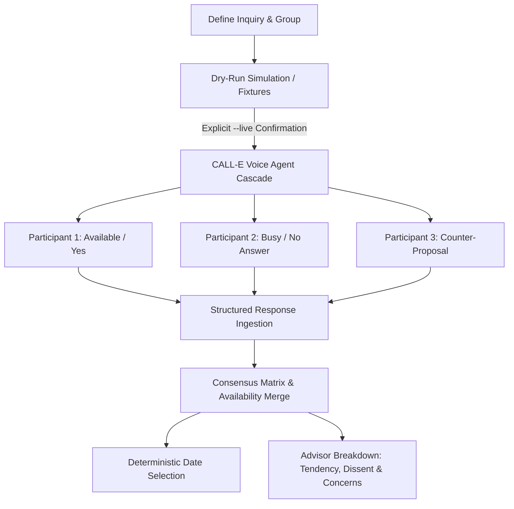

## Demo video

[](https://youtu.be/ipcyT63csPw)


# Ringedingeding

[](https://github.com/ellmos-ai)
[](https://github.com/open-bricks)
[](LICENSE)
[](https://www.python.org/)
[](tests/)
[](llms.txt)

> [!NOTE]
> **AI Agent & LLM Context**: A standardized, machine-readable summary is available at [`llms.txt`](llms.txt).

**English · [Deutsch](README_de.md)**

**Ask everyone, get one answer.**

Ask one question to several people by telephone and merge the replies into a
single result. Built on [CALL-E](https://github.com/CALLE-AI/call-e-integrations).



There are now two deliberately separate products on top of that mechanism:

* **Find a Date** asks *“when can you?”*, intersects availability and lets the
  organizer decide and announce one date.
* **Ask Your Advisor** asks *“what do you think?”*, then reports the leading
  tendency, countervoices, reasons and concerns. It never turns dissent into a
  false consensus.

Both can start from a freely named, reusable group. “Friends”, “Family” and
“Tennis Club” are examples, not presets.

Anyone who has tried to arrange a family dinner knows the problem: three people
reply immediately, two never do, and one calls back and tells you out loud. A
poll link does not fix that, because the people who do not answer links are
exactly the people whose answer you are missing.

So this calls them, asks the question, and puts the answers into one table —
including, prominently, the people it could not reach.

```
RESULT   : Works for all 4 who answered: Sa 14-18

Slot by slot (blank means the person was not asked or did not say):
+----------+-----+-------------------------+------------+---------+
| Slot     | Can | Who can                 | Who cannot | Unclear |
+----------+-----+-------------------------+------------+---------+
| Sa 14-18 | 4   | Anna, Ben, Clara, David | -          | -       |
| Sa 18-21 | 2   | Anna, David             | Ben, Clara | -       |
| So 10-14 | 2   | Clara, David            | Anna, Ben  | -       |
+----------+-----+-------------------------+------------+---------+

Answers  : 4 of 6 participants
NOTE     : Based on 4 of 6 participants. not reached: Erik (NO_ANSWER),
           Frida (BUSY). These are not counted as indifferent.
```

(Real output of `ringedingeding demo`, line-wrapped in the NOTE only.)

That last line is the point of the whole program. An intersection over four of
six people is a different fact from an intersection over six of six, and it has
to look different.

## Why not just use the CALL-E app?

Use it — for a single call the CALL-E chat is faster than anything you could
build, and this project does not try to replace it. Its four categories
(*Personal Message · Ask a Business · Book or Reschedule · Follow Up*) are all
one-to-one patterns, and so are the other integrations in the ecosystem: they
call **one** person.

This exists for the case the chat cannot cover: **many calls from one brief,
answers that are schema-validated instead of prose, and a single merged result
instead of six transcripts to read.** Asking six relatives about a weekend in
the chat means typing six times, reading six transcripts, working out the
intersection yourself — and remembering, on your own, that the two people who
never picked up did not agree to anything.

That last part is the reason for the whole program, and it is the one a person
doing it by hand gets wrong.

**One command shows it, with no account and no network:**

```bash
python -m ringedingeding proof
```

Seven people, three candidate times, about a second. It builds the round in a
temporary database, replays scripted answers, and then checks its own result
against the four ways a merge can quietly lie — disagreement counted as
majority, silence read as "no", three kinds of absence folded into one failure,
and the person whose number is missing dropped from the report. Exit code 0
means all eight checks passed.

Its ending is the argument in miniature: one invitee has no phone number, so she
is not called, and the result reads *"works for all 3 who answered"*. Add her
number, run the same round again — exactly one call is placed, and that result
turns out to have been wrong.

## Three ways in, one flow

The same logic is reachable three ways, and none of them is a wrapper around
another. They all call `service.py`, which is where the flow actually lives.

| | for | start with |
|---|---|---|
| **command line** | you, in a terminal | `ringedingeding project new …` |
| **skill** | somebody else's agent | [`SKILL.md`](SKILL.md) |
| **web interface** | somebody who would rather click | `ringedingeding web` |

If a rule appears in one of them that the other two do not have, that is a bug,
not a feature.

[`ARCHITEKTUR.md`](ARCHITEKTUR.md) has the full design, including the parts not
built yet and where they will attach.

[`CONVERSATION-TREE.md`](CONVERSATION-TREE.md) maps every setting — Web-UI field, CLI flag and
model field — to the exact place (or absence) in the call script it drives, with a coverage
table naming every gap found and fixed.

## Install

Python 3.11 or newer. **No third-party dependencies** for the command line — the
dry run has to work on a machine with nothing installed and no network.

```bash
git clone https://github.com/ellmos-ai/ringedingeding.git
cd ringedingeding
pip install -e .
```

## CALL-E API access

Dry runs (`proof`, fixtures, `--mode script`, and `--mode rehearsal`) work
without an API key. A live run resolves `CALLE_API_KEY` in this exact order;
the first non-empty value wins:

1. the process environment variable `CALLE_API_KEY`;
2. `CALLE_API_KEY` in `.env` in the project directory (override the path with
   `CALLE_ENV_FILE`);
3. `CALLE_API_KEY` in the ignored project file `config.local.json` (override
   the path with `CALLE_CONFIG_FILE`).

The `.env` entry is:

```dotenv
CALLE_API_KEY=...
```

The local JSON config uses `{"CALLE_API_KEY": "..."}`. The web interface at
`/settings` can save that config value and displays only a masked fingerprint
with the final four characters. It never returns the full value in HTML, logs,
or errors. The operator-managed credential directory is
`C:\_Local_DEV\CREDENTIALS\call-e\` (`call-e.md`, `call-e.env`); point
`CALLE_ENV_FILE` at the env file if you want to use it in place.

Real calls cost money. They still require the explicit live mode and its typed
confirmation; configuring a key alone never starts a call.

Or run it straight from the source tree without installing:

```bash
python -m ringedingeding demo
```

The web interface is an optional extra, so that the line above stays true:

```bash
pip install -e ".[web]"
ringedingeding web
```

## Try it without an account

Two ways, both offline. **`proof`** is the short one — one round, seven people,
eight checks, about a second, described above:

```bash
ringedingeding proof
```

**`demo`** is the broad one. It runs every bundled fixture end to end against
scripted answers — a scheduling question, a decision between two options with an
abstention and a refusal, an open question, and the `proof` scenario — and
writes a Markdown report for each into `out/`:

```bash
ringedingeding demo
```

Neither one opens a socket or reads a credential.

## Finding a date with a group

The commands above ask **one question**. Arranging a date is a longer
conversation — candidate days, an address book, criteria, a decision, and
telling everybody afterwards — so it has its own set of commands that walk that
conversation in order. `SKILL.md` hands the same sequence to an agent, and the
web interface walks it with forms.

```bash
# 1. what is it about, and in whose name
ringedingeding project new --occasion "Familienessen am Wochenende" --organizer "Lukas"

# 2. which days, and one standard time for all of them
ringedingeding project dates --project prj_a1b2 --day 2026-08-08 --day 2026-08-09 \
                             --time 14:00-18:00 --time 18:00-21:00

# 3. whom to invite, out of your own address book
ringedingeding contact add --name "Anna" --phone "+15555550101"
ringedingeding project people --project prj_a1b2 Anna Ben Clara

# 4. your own words, spoken verbatim
ringedingeding project wording --project prj_a1b2 \
    --greeting "Schön, dass ich dich erreiche." --closing "Danke dir!"

# 5. see the whole order text before anything is sent
ringedingeding project plan --project prj_a1b2 --show-task

# 6. place the calls
ringedingeding project call --project prj_a1b2 --mode rehearsal   # invented answers
ringedingeding project call --project prj_a1b2 --mode live        # real telephones

# 7. who can when, 8. what matters, 9. decide, 10. tell everybody
ringedingeding project board    --project prj_a1b2
ringedingeding project criteria --project prj_a1b2 --favourite 1 --must Anna --count 4
ringedingeding project decide   --project prj_a1b2 --slot 1
ringedingeding project invite   --project prj_a1b2
```

The board keeps five things apart, and that is the whole point of it:

```

## Asking your advisors

The opinion flow shares contacts, groups, safety gates and call mechanics with
scheduling, but its result is not an intersection:

```bash
ringedingeding group add --name "Product council" --member Anna --member Ben
ringedingeding project new --mode roundtable --occasion "New club room" \
    --organizer "Mira" --group "Product council"

# no options: open advice; repeat --option at least twice for a reasoned vote
ringedingeding project question --project prj_a1b2 \
    --question "Should we rent the larger room?"
ringedingeding project plan --project prj_a1b2 --show-task
ringedingeding project call --project prj_a1b2 --mode rehearsal
ringedingeding project board --project prj_a1b2
```

Open answers retain each person's wording and classify only their direction
(`support`, `against`, `mixed`, `neutral`, `unclear`). The board shows the
leading direction and countervoices next to the underlying reasons and
concerns. A choice question keeps the tally, abstentions, out-of-list answers,
conditions, reasons and concerns separate.
  1. Sa 08.08. 14:00-18:00        4 can  [3 von 3 criteria]
       can   : Anna, Ben, Clara, David
       cannot: —
       silent: —  (not a no)

not reached : Erik (NO_ANSWER), Frida (BUSY)
no phone    : Greta  <- add a number and run again to catch up
These are never counted as 'doesn't mind'.
```

**Catching up on somebody has no special mode.** Add the number, run the round
again; that one call is placed and nobody else is dialled twice:

```bash
ringedingeding contact phone Greta "+15555550199"
ringedingeding project call --project prj_a1b2 --mode rehearsal
```

### Three ways to run a round

| mode | dials | answers | marked |
|---|---|---|---|
| `--mode script` | no | replayed from a bundled example file | — |
| `--mode rehearsal` | no | **invented locally**, deterministic, schema-valid | round is flagged `simulated`; every screen says so |
| `--mode live` | **yes** | real | needs `CALL THEM` typed, and `CALLE_API_KEY` |

The rehearsal exists so that the calendar, the criteria and the invitation can
be seen without spending money on calls. It never pretends: the answers are
stamped as invented and can be thrown away with one command.

## The web interface

```bash
pip install -e ".[web]"
ringedingeding web            # http://127.0.0.1:8765
```

Server-rendered HTML, one stylesheet, one vendored copy of htmx. No npm, no
build step, no CDN — a page that needed the network would defeat the point of a
dry run. It binds to the loopback interface and has no login, because it is not
exposed to anything.

**The browser displays; the server drives.** Placing the calls happens in a
thread inside the server process, so the window can be closed and reopened
without ending a round — six people at a minute and a half each is long enough
that somebody will. The live view updates over Server-Sent Events when
JavaScript is available and reloads itself when it is not; either way the state
comes out of SQLite.

Click "Beispielprojekt anlegen" on the front page to get a complete project —
contacts, candidate dates and scripted answers — with no account and no network.

The local `/settings` page accepts a key for the ignored project config and
shows only its masked final four characters. Environment and `.env` values keep
their documented higher priority.

The interface is complete in German and English. The language switch uses the
ported Editor-PythonBox `TranslationSystem`, its UTF-8 JSON catalog in
`ringedingeding/locales/translations.json`, and the companion
`manage_translations.py` maintenance command. No browser translation service
or network request is involved.

`/calendar` combines the dated candidates of all scheduling projects. Project
checkboxes are not cosmetic: the visible tuple is passed unchanged to both
exports. Download it as a real `.xlsx` workbook or an RFC 5545 `.ics` file.
Google Calendar and Microsoft Calendar can import the ICS file; direct account
linking is not implemented, so the offline path needs no OAuth credentials.

## Use it for real

### 1. Create a poll

```bash
ringedingeding create \
  --question "When can you make it this weekend?" \
  --kind slot \
  --organizer "Lukas" \
  --slot "Sat 14-18" --slot "Sat 18-21" --slot "Sun 10-14" \
  --participant "Anna=+15555550100" \
  --participant "Ben=+15555550101"
```

`--kind` is one of:

| kind     | question                        | result                         |
|----------|---------------------------------|--------------------------------|
| `slot`   | "When can you make it?"         | intersection, plus who cannot  |
| `choice` | "Photo book or voucher?"        | tally, plus abstentions        |
| `open`   | "What should we do about X?"    | tendency + dissent + quoted evidence |

Numbers must be E.164 (`+49…`). They are validated before storage and again
before dialling.

### 2. Look at what would happen

```bash
ringedingeding plan --poll poll_ab12cd34ef
```

This prints who would be called, the exact instructions the voice agent would
receive, the JSON schema it would have to fill in, the estimated cost and the
estimated duration. It dials nothing.

### 3. Place the calls

```bash
ringedingeding run --poll poll_ab12cd34ef --markdown result.md
```

Without `--live` this refuses to run against real people — there is nothing
honest to simulate a real person's answer with. Add `--live` and type the
confirmation when asked:

```bash
export CALLE_API_KEY="…"
ringedingeding run --poll poll_ab12cd34ef --live --markdown result.md
```

### 4. Read the result again later

```bash
ringedingeding report --poll poll_ab12cd34ef --markdown result.md
```

### Commands

| command    | what it does                                        |
|------------|-----------------------------------------------------|
| `proof`    | the core sample: one round, and eight checks on it   |
| `demo`     | run every bundled fixture end to end (dry run)      |
| `fixtures` | list the bundled fixtures                           |
| `create`   | create a poll                                       |
| `list`     | list stored polls and their progress                |
| `plan`     | show who would be called, and with what             |
| `run`      | place the calls (dry run unless `--live`)           |
| `report`   | show or export the merged result                    |
| `web`      | start the local web interface                       |
| `contact`  | the address book (`add`, `list`, `phone`)           |
| `group`    | reusable target groups (`add`, `list`)               |
| `project`  | scheduling and advisor flows (see above)             |

Useful flags for `run`: `--serial` (one API request per person instead of one
batch), `--concurrency N`, `--retry` (call people who already answered),
`--no-names` (send no name at all), `--fresh` (drop earlier answers).

## Where your data goes — read this before using `--live`

**The voice agent does not run on your machine.** It runs at CALL-E / AiRudder
in **Singapore**. Everything placed into a call instruction leaves your computer
and is processed there.

What is sent per call:

* the **question**, and the options or time slots you defined,
* the **organizer's name**, so the call can say whose behalf it is on,
* the participant's **first name only** — never the full name,
* the participant's **telephone number**, because you cannot dial a mask,
* the participant's local reference id and the poll id, which mean nothing
  outside your own database,
* the result schema the agent must fill in.

What is **not** sent: any other participant, anybody else's answer, previous
polls, full names, notes, or anything kept "just in case". `--no-names` drops
the first name too.

What comes **back** and is stored locally: the filled-in schema, a short
summary and — when the service provides one — the transcript of the
conversation. The transcript is kept deliberately: the voice agent *interprets*
free answers, so without the wording underneath, its categorisation could never
be checked. Everything stays in a local SQLite file (`ringedingeding.db`) which
is git-ignored.

Under the GDPR you are the controller for this processing. Tell people
beforehand, and only call people who expect it.

## Safety

These are not settings. They are how the program is built.

* **The dry run is the default.** `--live` is the only path to a telephone, and
  it is not enough on its own: you also have to type `CALL THEM`. For
  unattended runs both `RINGEDINGEDING_LIVE_CONFIRM=CALL THEM` in the
  environment **and** `--yes` are required. There is no silent live mode.
* **The bundled example numbers can never ring.** Running `--live` against a
  shipped fixture is refused by name.
* **Numbers never appear in output.** Not in the console, the Markdown report,
  the logs or an error message — including text that came back from the call
  side, which is scrubbed on the way out.
* **The call discloses itself in its first sentence**, unprompted, quoting the
  organizer's name. Not on request — from the start.
* **A refusal is a result.** The instructions forbid persuading, asking twice,
  or offering reasons.
* **Medical, legal, financial and emergency questions are refused** at creation
  time, so the number is never even stored. There is no override flag.
* **Nobody is called twice for the same intent.** Every call carries a
  deterministic `Idempotency-Key`, and a participant with an answer is skipped
  unless you pass `--retry`.
* **No hidden schedule.** No daemon, no retry loop, no background timer. One
  invocation makes at most one attempt per person and exits. If you want it
  repeated, your Task Scheduler or cron does it, where you can see it.
* **Credentials use the documented three-source resolver.** They never belong
  in commits, command-line arguments, logs, or error messages; the settings
  page writes only the ignored local config.
* **Invented answers admit it.** A rehearsal flags its round in the database,
  and every screen and report that shows it says the answers were made up.
* **One round at a time per project.** The web interface refuses to start a
  second run while the first is in flight, rather than relying on the
  idempotency key to clean up afterwards.
* **Nothing is stored twice.** Whether somebody can make a slot is computed from
  the answers every time it is shown; there is no second copy to drift.
* **Delete means erase the associated local call data.** Deleting a project also
  removes its project-scoped wording and questions plus every linked poll,
  participant, raw phone number, answer and transcript. Deleting a contact also
  removes the participant copies and interview material tied to that contact.
  Both paths are transactional and covered for simulated and non-simulated data.
  There is still no automatic retention period; deployment policy remains the
  operator's responsibility.

### If you interrupt it

`Ctrl-C` stops **new** calls from starting; calls already in progress are
allowed to finish, because hanging up on somebody mid-sentence is worse than
waiting a moment. A second `Ctrl-C` gives up immediately.

Either way the state on disk stays consistent: every answer is written the
moment it arrives, so what finished is saved and what never started stays
`PENDING`. Run the same command again and it picks up exactly there. The exit
code is `130`.

| exit code | meaning                                   |
|-----------|-------------------------------------------|
| 0         | success                                   |
| 1         | an error                                  |
| 2         | refused: sensitive content                |
| 3         | refused: live calling blocked or unconfirmed |
| 130       | interrupted; state on disk is consistent  |

## What it costs, and how long it takes

CALL-E charges **per call, not per minute** — about $0.05, with 20 free. Six
people cost about 30 cents whatever they say.

Time behaves differently. Roughly **40 seconds of every call is dialling and
connecting** before a word is spoken, measured and independent of how long
anybody talks. Six people one after another therefore take around a quarter of
an hour, most of it silence. `plan` prints both figures.

Calls can be placed one batch request at a time (default) or one request per
person (`--serial`), and `--concurrency N` fans out. **Whether CALL-E actually
runs calls in parallel has not been verified**, so the code supports both and
the estimate tells you which number to trust.

## While a call is running

A live run prints the conversation as it happens:

```
  dialing  anna (+49*****01)
     00:00:00.000 --     | Call is ringing.
     00:00:04.000 --     | Call connected.
     00:00:05.000 bot    | Hello, this is an automated assistant on behalf of Lukas.
     00:00:07.000 callee | Yes, go ahead.
  <- anna: COMPLETED
```

(Shape of the output, produced from a replayed `activity` payload. The
timestamps and wording of a real call will differ.)

This comes from the API's `activity` field, not from `status`. The status field
is useless as a progress indicator: it was measured sitting on `PREPARING`
throughout an entire conversation and only moved to `COMPLETED` about
24 seconds *after* the call had ended.

Speech recognition streams a rough transcription and corrects it a fraction of
a second later, so the newest line is held back for one poll rather than shown
and then contradicted.

## How the conversation is steered

CALL-E has no field for tone, persona or script. There are exactly two levers,
and the second is the strong one:

1. the `task` free text — the instructions read above,
2. the **`recipient_result_schema`** — the JSON the agent must fill in.

Whatever the schema demands, the agent has to find out during the call. So the
schema is designed first and the prose written to match it. Every schema here
carries three fields that exist purely to keep the merge honest:

* `reachable` — false when somebody answered, but not the person we wanted,
* `refused` — true when the person was reached and chose not to answer,
* `note` / `condition` — the qualifier a tally would otherwise flatten
  ("yes, but only under 50 euros").

One measured detail shapes the wording: **text in quotation marks is spoken
verbatim**, character for character, while text outside quotation marks is
rephrased and even extended by the planning agent. So the question itself and
the sentence disclosing that this is an automated call are quoted; the rest is
guidance on purpose.

## How the answers are merged

Two rules, both of which exist to stop the program inventing agreement:

**A person who was not reached is never counted as "doesn't mind."** No
aggregate is computed over "everyone". It is computed over the people who
actually answered, and everyone else is reported by name with their concrete
status — `NO_ANSWER`, `BUSY`, `DECLINED` and `VOICEMAIL` are four different
pieces of news and stay four different pieces of news.

**Silence about a slot is not a "no."** If somebody was asked about Saturday
and Sunday and only said "Saturday works", Sunday is listed as *unclear*, not
as *cannot*.

Answers outside the offered options, abstentions and conditions attached to a
vote are all reported separately rather than being folded into the tally.

## Limits

* A field trial with real, informed participants has taken place, more than
  once — see [How We Tested](#how-we-tested) below for what it covered and
  what it found.
* Provider-side concurrency remains unverified (see above).
* Advisor mode is built; the roundtables for further question types exist but
  are empty.
* Four date types remain unimplemented: a whole week, a month, several
  consecutive days, and a recurring weekday.

## Tests

```bash
pip install -e ".[dev]"
pytest
```

The whole suite runs without an account, without a network and without dialling
anything. Where the live path is exercised, it stops at a guard before any
socket is opened.

The latest recorded full run passed 371 tests on 2026-08-05 (one existing
Starlette `TestClient` / `httpx` deprecation warning).

## How We Tested

Every live call this project has ever placed went to one number the author
controls and consented to receiving calls on. Rather than rewriting a dialled
number at call time, the author entered that same number directly, more than
once, as different named contacts — which is also, as it turned out, exactly
the household case (two names on one landline) that surfaces later in this
section. The author played every counterpart himself. No test run *in this
repository* has ever dialled anything; every finding below happened through
the deployed application, outside this repository, and was relayed back with
exact database rows and wording (the primary record is `AUFGABEN.txt` and
`FINDINGS.md`; what this repository itself ran against those relayed facts is
in `EVIDENCE.md`).

**2026-08-01 — the first live call.** The very first `POST /v1/calls` this
project ever made established the basics no documentation gave for free:
progress comes from `activity`, not `status` (which sat on `PREPARING`
through the whole conversation); the transcript lives in a nested
`result.transcript` field; a question given in quotes is spoken verbatim,
character for character; and a free spoken answer is interpreted into a
category by the voice agent itself, not just recorded.

**2026-08-11(-12) — mailbox, decline, region defaults, and a false
consensus.** A further live session relayed two more call outcomes that had
no matching status field on the wire at all — a mailbox pickup that came back
as a plain, successful `completed` call, and an active decline that came back
as a generic `failed` with the real reason buried in a message string — both
now read from the transcript and the failure text instead of trusted status
codes. The same session, testing region and language together, found a
German-language poll silently carrying an English-region voice profile into
its call plan, and a literal `fuer`-style ASCII stand-in for an umlaut read
aloud exactly as typed. A live Advisor round with two participants giving
opposite, well-reasoned answers to an either-or question was reported back as
`Tendency: support (2 of 2)` — the aggregation logic had no notion that
"support" can mean two different things when there is no shared proposal to
support, exactly the false-consensus case this project's own README
explicitly promises never to produce.

**2026-08-22 — a full acceptance walkthrough, then a same-day retest.** An
availability round and an Advisor/roundtable round were both run live end to
end. In both, two of the invited contacts shared one real number — and in
both, the service placed a single physical call and returned it as two
identical, separately stored answers under two different identities: one
conversation counted as two people's consent. A screen showing a rehearsal as
"real calls running", stale rehearsal answers left over the moment a round
actually went live, and a translation hint seen once in the wrong language
were reported the same day. Fixes for all of these were written, tested and
pushed before the session ended. A follow-up live retest the same day
confirmed the phone-number fix worked exactly as intended — both rounds
correctly reported zero answers instead of a fabricated one, with an explicit
warning naming the shared number as the reason — but also showed the fix was
scoped too broadly, blocking the batch endpoint's household case even where a
call is placed one person at a time and the mix-up cannot occur; a second,
narrower fix followed the same day, and a further live retest of that
correction confirmed it: two separate calls to the same shared number, two
separate call references, one participant's answer correctly attributed to
that participant alone. That same retest turned up one more finding, told in
full below: a live call that skipped the identity confirmation question
entirely, even though the instruction already stood in the text.

**What went wrong, and what became of it:**

1. **One physical call, credited to two different people — twice, then
   over-corrected, then corrected again.** The root cause: the service can
   fold two recipients that share a phone number into a single real
   conversation while still returning one answer entry per recipient in its
   response, so nothing in the response shape itself says a mix-up happened.
   First found live in an availability round, the same collapse then turned
   up in an Advisor round, and in the report it fabricated an apparent
   2-of-2 consensus out of one person's words. Fixed by refusing to build a
   call for anyone sharing a due number with someone else in the same run,
   and by refusing to count two stored answers with the identical call
   reference as two votes. The same-day retest confirmed the block worked —
   but also confirmed it applied too broadly, silently disabling the one
   call mode (person at a time) where the collision cannot happen at all.
   The block now lives only where the collision is actually possible; a
   live retest of the person-at-a-time path confirmed it dials everyone,
   unaffected — two separate calls to the shared number, two separate
   references, no mix-up.
2. **A rehearsal that looked like it was placing real calls.** Two
   independent on-screen indicators for "this is a rehearsal" and "this call
   is live" could be true at the same time, and the live one always won
   visually. Fixed so the rehearsal state always wins on screen, with a
   distinct, dimmed marker for its own answered/calling rows so they can
   never be mistaken for a real result.
3. **Going live reused a rehearsal's invented answers.** Starting a round
   for real, after it had been rehearsed, silently kept the rehearsal's
   stand-in answers instead of asking anyone anything — the screen looked
   identical to before, nothing new to see. Fixed: a round's rehearsal
   answers are discarded automatically the moment a live call is actually
   about to be placed against it.
4. **A hint text seen in the wrong language once.** A form's help text
   appeared in English inside an otherwise German interface. Checked
   directly against the translation mechanism itself, which rendered
   correctly with a fresh session — the live sighting most likely came from
   a stale language cookie already open in that browser, not a defect in the
   translation code, and is reported honestly as unreproduced rather than
   claimed as a fixed root cause. The wording was clarified regardless,
   since it genuinely needed to be, and is now pinned by a test in both
   languages.
5. **An instruction that already stood in the text was skipped anyway.** In
   the same retest, a live call to a different contact never asked the
   identity-confirmation question at all — "Am I speaking with ...?", which
   already stood as step 2 of the goal, worded "first ask ...". The
   conversation was otherwise complete — a clear preference, a stated
   reason — but the result correctly withheld it: no confirmed identity, no
   vote, the same conservative rule as item 1 above. What the report showed
   next to it, though, was "NOT REACHED" with an empty reason, which reads
   as missing data rather than the deliberate refusal it actually was. Both
   are now fixed: the question is marked CRITICAL and explicitly ordered
   before anything else instead of reading as one step among several, and
   the report now says outright that the call completed and a real
   conversation happened, but the answer was withheld for lack of a
   confirmed identity. The lesson, worth stating plainly: an instruction
   being present in the text is not the same as an instruction a model
   treats as non-negotiable. A day later, a retry of that exact contact
   placed a correction call instead of a plain repeat — identity confirmed
   first, the question asked fresh only after a confirmed yes — and the
   round it belonged to ended with every participant counted.

**Still open, honestly:** the error text a rejected or failed call carries
into the operator's own view — why a number was refused, why a transport call
failed, the wording of the phone-collision block above — is, and always has
been, English-only project-wide, even inside the German interface.
Deliberately left alone during this acceptance pass rather than rushed into a
wider bilingual rework that would have touched several modules at once while
the rest of the fixes were still landing; tracked as its own, separate piece
of work.

## Project layout

```
ringedingeding/
  cli.py            commands, the confirmation gate, exit codes
  cli_projects.py   the date-finding flow on the command line
  service.py        THE flow — the one layer all three ways in share
  proof.py          the core sample, and the checks it runs on itself
  projects.py       contacts, candidate dates, criteria, decision
  models.py         polls, participants, call statuses, buckets
  schemas.py        result schemas and the spoken instructions
  merge.py          many answers into one result
  render.py         console tables and the Markdown report
  runner.py         poll -> calls -> stored answers
  store.py          SQLite
  safety.py         refused categories, live gate, idempotency
  phone.py          E.164 validation and masking
  activity.py       reading a call live, and its transcript
  timings.py        measured timing of the service
  transports/
    fixture.py      the dry run
    rehearsal.py    invented answers, marked as invented
    calle.py        the only code that can dial
  web/
    app.py          routes, thin
    jobs.py         calling in the background — "the browser does not drive"
    ui.py           calendar grouping, avatars, status wording
    templates/      Jinja2, server-rendered
    static/         app.css, app.js, htmx.min.js (vendored)
  fixtures/         scripted polls for the dry run
```

`ARCHITEKTUR.md` is the full design, including stages 2 and 3 and why the tables
look the way they do. `SKILL.md` is the same flow written for somebody else's
agent. `FINDINGS.md` records what was measured against the real service and
where that contradicts the documentation. `EVIDENCE.md` records what was
actually executed in this repository, including what was not.

## Third-party code

[htmx](https://htmx.org) 2.0.4 is vendored at
`ringedingeding/web/static/htmx.min.js` (BSD Zero Clause Licence,
`sha256:e209dda5c8235479f3166defc7750e1dbcd5a5c1808b7792fc2e6733768fb447`).
Vendored rather than loaded from a CDN so the interface works with no network at
all. Nothing else is bundled.

## Licence

MIT.
