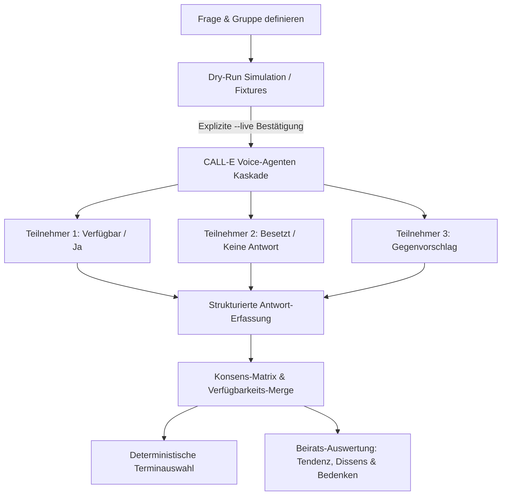

## Demovideo

[](https://youtu.be/ipcyT63csPw)


# Ringedingeding

[](https://github.com/ellmos-ai)
[](https://github.com/open-bricks)
[](LICENSE)
[](https://www.python.org/)
[](tests/)
[](llms.txt)

> [!NOTE]
> **KI-Agenten- & LLM-Kontext**: Eine standardisierte, maschinenlesbare Zusammenfassung ist unter [`llms.txt`](llms.txt) verfügbar.

**[English](README.md) · Deutsch**

**Frag alle, bekomm eine Antwort.**

Stell mehreren Leuten dieselbe Frage per Telefon und führe die Antworten zu einem Ergebnis
zusammen. Gebaut auf [CALL-E](https://github.com/CALLE-AI/call-e-integrations).



Auf demselben Mechanismus stehen zwei bewusst getrennte Produkte:

* **Termin finden** fragt *„wann kannst du?"*, bildet die Schnittmenge und überlässt dem
  Organisator die Entscheidung und die Ansage.
* **Beirat befragen** fragt *„was hältst du davon?"* und berichtet Tendenz, Gegenstimmen,
  Begründungen und Bedenken. Aus Widerspruch wird nie ein Scheinkonsens.

Beide starten aus einer frei benannten, wiederverwendbaren Gruppe. „Freunde", „Familie" und
„Tennisverein" sind Beispiele, keine Vorgaben.

Wer schon einmal ein Familienessen verabreden wollte, kennt das Problem: Drei antworten
sofort, zwei nie, und einer ruft zurück und sagt es mündlich. Ein Umfragelink löst das
nicht, denn genau die Leute, die auf Links nicht reagieren, sind die, deren Antwort fehlt.

Also ruft dieses Werkzeug sie an, stellt die Frage und trägt die Antworten in eine Tabelle
ein — **einschließlich, und zwar sichtbar, der Leute, die es nicht erreicht hat**.

```
RESULT   : Works for all 3 who answered: Sat 09-13

not reached : Tara (NO_ANSWER), Uwe (BUSY)
declined    : Sven   (picked up, chose not to answer)
no phone    : Vera   (never called — a number can be added)
None of the above is counted as agreement.
```

Die letzte Zeile ist der ganze Sinn des Programms. Eine Schnittmenge über drei von sieben
Personen ist eine **andere Tatsache** als eine über sieben von sieben, und sie muss anders
aussehen.

---

## Warum nicht einfach die CALL-E-App?

Benutz sie. Für **einen** Anruf ist der CALL-E-Chat schneller als alles, was man hier bauen
könnte, und dieses Projekt versucht nicht, ihn zu ersetzen.

Der Unterschied ist die Menge, nicht der Anruf:

* **Anzahl** — die App macht einen Anruf, von Hand angestoßen. Dies macht viele aus **einem**
  Auftrag.
* **Antwortform** — die App liefert Fließtext plus die Deutung des Agenten. Dies liefert je
  Empfänger ein **schema-validiertes** Ergebnis, also vergleichbare Antworten.
* **Ergebnis** — bei der App liest am Ende ein Mensch N Protokolle. Hier entsteht **ein**
  zusammengeführtes Ergebnis, mit der Zahl der Personen, auf denen es beruht.
* **Zustand** — jeder Chat beginnt neu. Dies merkt sich zwischen den Läufen, wer geantwortet
  hat, wer noch offen ist und wer gar nicht anrufbar ist.

Die vier Kategorien der Anbieter-App — Personal Message, Ask a Business, Book or Reschedule,
Follow Up — sind allesamt Eins-zu-eins-Muster, und die übrigen Integrationen im Ökosystem
ebenso. Eine Gruppe dasselbe zu fragen und die Antworten zusammenzuführen, ist die Lücke.

---

## Kernprobe für Juroren — ein Befehl, keine Zugänge

Etwa eine Sekunde, ohne Konto, ohne API-Schlüssel, ohne Netz:

```bash
python -m ringedingeding proof
```

Der Befehl baut in einer temporären Datenbank eine Runde mit sieben Personen, spielt
vorgeschriebene Antworten ein und prüft anschließend **das eigene Ergebnis** gegen die vier
Arten, wie eine Zusammenführung stillschweigend lügen kann: Widerspruch als Mehrheit
verbucht, Schweigen als „nein" gelesen, drei Arten von Nichterreichen zu einem Fehler
verschmolzen, und die Eingeladene ohne Rufnummer aus dem Bericht gefallen. **Exit-Code 0
heißt: alle acht Prüfungen bestanden.**

Der letzte Schritt ist das Argument im Kleinen. Eine Eingeladene hat keine Rufnummer, wird
deshalb nie angerufen, und die Runde meldet einen Termin, der „für alle 3, die geantwortet
haben" passt. Trägt man ihre Nummer nach und lässt dieselbe Runde erneut laufen, wird genau
**ein** Anruf gemacht — und das frühere Ergebnis stellt sich als falsch heraus.

Die breite Variante lässt alle mitgelieferten Fixtures Ende zu Ende laufen (Terminfrage,
Entscheidung zwischen zwei Optionen mit Enthaltung und Verweigerung, offene Frage sowie das
`proof`-Szenario) und schreibt je einen Markdown-Bericht nach `out/`:

```bash
ringedingeding demo
```

Keiner der beiden Befehle öffnet einen Socket oder liest Zugangsdaten.

---

## Drei Zugänge, ein Ablauf

Dieselbe Logik ist auf drei Wegen erreichbar, und keiner ist eine Hülle um einen anderen.
Alle rufen `service.py` auf — dort liegt der Ablauf.

* **Kommandozeile** — für dich im Terminal: `ringedingeding project new …`
* **Skill** — für den Agenten von jemand anderem: [`SKILL.md`](SKILL.md)
* **Weboberfläche** — für alle, die lieber klicken: `ringedingeding web`

Taucht in einem davon eine Regel auf, die die anderen beiden nicht haben, ist das ein Fehler,
kein Merkmal. Der vollständige Entwurf steht in [`ARCHITEKTUR.md`](ARCHITEKTUR.md),
einschließlich der noch nicht gebauten Teile und der Stellen, an denen sie ansetzen.

## Installation

Python 3.11 oder neuer. **Keine Fremdabhängigkeiten** für die Kommandozeile — der
Trockenlauf muss auf einer Maschine funktionieren, auf der nichts installiert ist und die
kein Netz hat.

```bash
git clone https://github.com/ellmos-ai/ringedingeding.git
cd ringedingeding
pip install -e .
```

## CALL-E-API-Zugang

Trockenläufe (`proof`, Fixtures, `--mode script` und `--mode rehearsal`)
funktionieren ohne API-Schlüssel. Ein Live-Lauf sucht `CALLE_API_KEY` genau in
dieser Reihenfolge; der erste nicht leere Wert gewinnt:

1. Umgebungsvariable `CALLE_API_KEY` des Prozesses;
2. `CALLE_API_KEY` in `.env` im Projektverzeichnis (Pfad mit
   `CALLE_ENV_FILE` änderbar);
3. `CALLE_API_KEY` in der ignorierten Projektdatei `config.local.json` (Pfad
   mit `CALLE_CONFIG_FILE` änderbar).

Der Eintrag in `.env` lautet:

```dotenv
CALLE_API_KEY=...
```

Die lokale JSON-Config verwendet `{"CALLE_API_KEY": "..."}`. Unter
`/settings` kann die Weboberfläche diesen Config-Wert speichern. Angezeigt wird
nur eine maskierte Kennung mit den letzten vier Zeichen; der vollständige Wert
erscheint weder im HTML noch in Logs oder Fehlermeldungen. Das vom Betreiber
verwaltete Zugangsdaten-Verzeichnis ist `C:\_Local_DEV\CREDENTIALS\call-e\`
(`call-e.md`, `call-e.env`); mit `CALLE_ENV_FILE` kann direkt auf die Env-Datei
verwiesen werden.

Echte Anrufe kosten Geld. Sie brauchen weiterhin den ausdrücklichen Live-Modus
und die eingetippte Bestätigung; ein eingerichteter Schlüssel startet keinen
Anruf.

Oder direkt aus dem Quellbaum, ohne Installation:

```bash
python -m ringedingeding demo
```

Die Weboberfläche ist ein optionaler Zusatz, damit der Satz oben wahr bleibt:

```bash
pip install -e ".[web]"
ringedingeding web
```

### Befehle

* `proof` — die Kernprobe: eine Runde und acht Prüfungen darauf
* `demo` — alle mitgelieferten Fixtures Ende zu Ende (Trockenlauf)
* `fixtures` — die mitgelieferten Fixtures auflisten
* `create` — eine Umfrage anlegen
* `list` — gespeicherte Umfragen und ihren Fortschritt anzeigen
* `plan` — zeigen, wer angerufen würde, und womit
* `run` — die Anrufe auslösen (Trockenlauf, sofern nicht `--live`)
* `report` — das zusammengeführte Ergebnis anzeigen oder ausgeben
* `web` — die lokale Weboberfläche starten
* `contact` — das Adressbuch (`add`, `list`, `phone`)
* `group` — wiederverwendbare Zielgruppen (`add`, `list`)
* `project` — Termin- und Beiratsabläufe

Nützliche Schalter für `run`: `--serial` (eine API-Anfrage je Person statt eines Stapels),
`--concurrency N`, `--retry` (auch Leute anrufen, die schon geantwortet haben), `--no-names`
(gar keinen Namen übermitteln), `--fresh` (frühere Antworten verwerfen).

---

## Wohin deine Daten gehen — vor `--live` lesen

**Der Sprachagent läuft nicht auf deiner Maschine.** Er läuft bei CALL-E / AiRudder in
**Singapur**. Alles, was in einen Anrufauftrag gelegt wird, verlässt deinen Rechner und wird
dort verarbeitet.

Je Anruf übermittelt werden:

* die **Frage** samt der von dir festgelegten Optionen oder Zeitfenster,
* der **Name des Organisators**, damit der Anruf sagen kann, in wessen Auftrag er erfolgt,
* ausschließlich der **Vorname** des Teilnehmers — nie der volle Name,
* die **Rufnummer** des Teilnehmers, denn eine Maske kann man nicht wählen,
* die lokale Referenz-ID und die Umfrage-ID, die außerhalb deiner Datenbank nichts bedeuten,
* das Ergebnisschema, das der Agent ausfüllen muss.

**Nicht** übermittelt werden: andere Teilnehmer, deren Antworten, frühere Umfragen, volle
Namen, Notizen oder irgendetwas, das „für alle Fälle" mitliefe. `--no-names` lässt auch den
Vornamen weg.

**Zurück** kommen und lokal gespeichert werden: das ausgefüllte Schema, eine kurze
Zusammenfassung und — sofern der Dienst eines liefert — das Gesprächstranskript. Das
Transkript wird bewusst aufbewahrt: Der Sprachagent *deutet* freie Antworten, und ohne den
darunterliegenden Wortlaut ließe sich seine Einordnung nie überprüfen. Alles bleibt in einer
lokalen SQLite-Datei (`ringedingeding.db`), die von Git ignoriert wird.

Nach der DSGVO bist du für diese Verarbeitung der Verantwortliche. Sag den Leuten vorher
Bescheid und ruf nur Leute an, die damit rechnen.

## Sicherheit

Das sind keine Einstellungen, sondern die Bauweise des Programms.

* **Der Trockenlauf ist die Voreinstellung.** `--live` ist der einzige Weg zum Telefon, und
  er genügt allein nicht: Man muss zusätzlich `CALL THEM` eintippen. Für unbeaufsichtigte
  Läufe braucht es `RINGEDINGEDING_LIVE_CONFIRM=CALL THEM` in der Umgebung **und** `--yes`.
  Einen stillen Live-Modus gibt es nicht.
* **Die mitgelieferten Beispielnummern können nie klingeln.** `--live` gegen ein
  ausgeliefertes Fixture wird namentlich abgelehnt.
* **Rufnummern erscheinen nirgends in der Ausgabe** — nicht in der Konsole, nicht im
  Markdown-Bericht, nicht im Log, nicht in einer Fehlermeldung. Auch Text, der von der
  Anrufseite zurückkommt, wird auf dem Weg nach draußen bereinigt.
* **Der Anruf offenbart sich im ersten Satz**, ungefragt, unter Nennung des Organisators.
  Nicht auf Nachfrage — von Anfang an.
* **Eine Absage ist ein Ergebnis.** Die Anweisungen verbieten Überreden, Nachfassen und
  Begründungen anbieten.
* **Medizinische, rechtliche, finanzielle und Notfallfragen werden schon beim Anlegen
  abgewiesen**, sodass die Nummer gar nicht erst gespeichert wird. Es gibt keinen Schalter,
  der das aufhebt.
* **Niemand wird zweimal für dieselbe Absicht angerufen.** Jeder Anruf trägt einen
  deterministischen `Idempotency-Key`; wer eine Antwort hat, wird übersprungen, sofern nicht
  `--retry` gesetzt ist.
* **Kein versteckter Zeitplan.** Kein Daemon, keine Wiederholschleife, kein Hintergrundtimer.
  Ein Aufruf macht höchstens einen Versuch je Person und endet. Wer Wiederholung will, richtet
  sie in der Aufgabenplanung oder in cron ein, wo man sie sieht.
* **Zugangsdaten folgen dem dokumentierten Drei-Quellen-Resolver.** Sie gehören nie in
  Commits, Kommandozeilenargumente, Logs oder Fehlermeldungen; die Einstellungsseite
  schreibt ausschließlich in die ignorierte lokale Config.
* **Erfundene Antworten sagen es.** Ein Probelauf markiert seine Runde in der Datenbank, und
  jede Anzeige und jeder Bericht dazu sagt, dass die Antworten ausgedacht sind.
* **Eine Runde je Projekt gleichzeitig.** Die Weboberfläche verweigert einen zweiten Lauf,
  solange der erste läuft, statt sich hinterher auf den Idempotenzschlüssel zu verlassen.
* **Nichts wird doppelt gespeichert.** Ob jemand einen Termin kann, wird bei jeder Anzeige
  aus den Antworten neu berechnet; es gibt keine zweite Kopie, die auseinanderlaufen könnte.
* **Löschen entfernt auch die zugehörigen lokalen Anrufdaten.** Beim Löschen eines Projekts
  verschwinden zusätzlich dessen Formulierungen und Fragen sowie alle verbundenen Umfragen,
  Teilnehmenden, Rohnummern, Antworten und Transkripte. Beim Löschen eines Kontakts werden
  auch die zugehörigen Teilnehmerkopien und Interviewdaten entfernt. Beide Wege laufen in
  einer Transaktion und sind für simulierte wie nicht simulierte Daten getestet. Eine
  automatische Löschfrist gibt es weiterhin nicht; dafür bleibt der Betreiber verantwortlich.

### Wenn du abbrichst

`Strg-C` verhindert, dass **neue** Anrufe starten; bereits laufende dürfen zu Ende gehen,
weil jemandem mitten im Satz aufzulegen schlimmer ist als einen Moment zu warten. Ein
zweites `Strg-C` bricht sofort ab.

So oder so bleibt der Zustand auf der Platte stimmig: Jede Antwort wird in dem Moment
geschrieben, in dem sie eintrifft. Was fertig wurde, ist gespeichert; was nie startete,
bleibt `PENDING`. Derselbe Befehl noch einmal setzt genau dort fort. Der Exit-Code ist `130`.

| Exit-Code | Bedeutung |
|---|---|
| 0 | Erfolg |
| 1 | ein Fehler |
| 2 | abgelehnt: sensibler Inhalt |
| 3 | abgelehnt: Live-Anrufe gesperrt oder unbestätigt |
| 130 | abgebrochen; Zustand auf der Platte ist stimmig |

## Was es kostet und wie lange es dauert

CALL-E rechnet **pro Anruf ab, nicht pro Minute** — etwa 0,05 USD, davon 20 frei. Sechs
Personen kosten also rund 30 Cent, egal was sie sagen.

Die Zeit verhält sich anders. Rund **40 Sekunden jedes Anrufs sind Wählen und Verbinden**,
bevor ein Wort fällt — gemessen und unabhängig davon, wie lange jemand spricht. Sechs
Personen nacheinander dauern deshalb etwa eine Viertelstunde, überwiegend Stille. `plan`
gibt beide Zahlen aus.

Anrufe können als Stapelanfrage (Voreinstellung) oder je Person einzeln (`--serial`)
ausgelöst werden, `--concurrency N` fächert auf. **Ob CALL-E Anrufe tatsächlich parallel
ausführt, ist nicht verifiziert** — deshalb unterstützt der Code beides, und die Schätzung
sagt, welcher Zahl zu trauen ist.

---

## Grenzen

* Ein Feldversuch mit echten, eingeweihten Teilnehmern hat stattgefunden, mehr
  als einmal — siehe [Wie wir getestet haben](#wie-wir-getestet-haben) weiter
  unten, was er abdeckte und was er fand.
* Parallelität auf Dienstseite ist ungeprüft (siehe oben).
* Der Beiratsmodus („was hältst du davon?") ist gebaut; die Rundentische für weitere
  Fragearten existieren und sind leer.
* Vier Terminarten fehlen noch (ganze Woche, Monat, mehrere aufeinanderfolgende Tage,
  wiederkehrender Wochentag). Dafür braucht es einen neuen Slot-Generator und sonst nichts.

## Tests

```bash
pytest -q
```

371 Tests, alle im Trockenlauf, ohne Konto und ohne Netz (eigener Lauf am 2026-08-05;
eine bestehende Starlette-`TestClient`/`httpx`-Deprecation-Warnung).
Der Trockenlauf ist kein Platzhalter, der „OK" zurückgibt: Er durchläuft Schema-Erzeugung,
Nutzlastaufbau je Empfänger, Statusabbildung, Zusammenführung und Berichterstellung und
prüft jede eingespielte Antwort gegen das Schema, das ein echter Anruf bekommen hätte. Ein
Fixture, das aus einem echten Anruf nicht hätte hervorgehen können, lässt den Trockenlauf
scheitern, statt still durchzulaufen.

---

## Wie wir getestet haben

Jeder Live-Anruf, den dieses Projekt je gemacht hat, ging an eine Nummer, die
dem Autor gehört und in deren Anrufe er eingewilligt hat. Statt eine gewählte
Nummer erst beim Anruf umzuschreiben, trug der Autor dieselbe Nummer direkt,
mehrfach, unter verschiedenen Kontaktnamen ein — was sich, wie sich zeigte,
genau als der Haushalts-Fall (zwei Namen auf einem Festnetzanschluss)
herausstellte, der weiter unten in diesem Abschnitt eine Rolle spielt. Der
Autor spielte jede Gegenrolle selbst. Kein Testlauf *in diesem Repository*
hat je gewählt — jeder Befund unten entstand über die tatsächlich betriebene
Anwendung, außerhalb dieses Repositorys, und wurde mit genauen
Datenbankeinträgen und Wortlaut zurückgemeldet (die primäre Quelle sind
`AUFGABEN.txt` und `FINDINGS.md`; was dieses Repository selbst gegen diese
zurückgemeldeten Fakten ausgeführt hat, steht in `EVIDENCE.md`).

**2026-08-01 — der erste Live-Anruf.** Der allererste `POST /v1/calls`, den
dieses Projekt je ausgelöst hat, klärte Grundlegendes, das keine
Dokumentation umsonst hergab: Fortschritt kommt aus `activity`, nicht aus
`status` (der die ganze Unterhaltung über auf `PREPARING` stehen blieb); das
Transkript liegt in einem verschachtelten `result.transcript`-Feld; eine in
Anführungszeichen gesetzte Frage wird zeichengenau gesprochen; und eine frei
gesprochene Antwort wird vom Sprachagenten selbst in eine Kategorie
eingeordnet, nicht nur mitgeschnitten.

**2026-08-11(-12) — Mailbox, Ablehnung, Region-Vorgaben und ein erfundener
Konsens.** Eine weitere Live-Sitzung meldete zwei Anrufausgänge zurück, für
die es auf der Leitung gar kein passendes Status-Feld gab — eine
Mailbox-Annahme, die als schlichter, erfolgreicher `completed`-Anruf
zurückkam, und eine aktive Ablehnung, die als generisches `failed` mit dem
eigentlichen Grund versteckt in einem Meldungstext zurückkam — beides wird
jetzt aus dem Transkript beziehungsweise dem Fehlertext gelesen statt den
Statuscodes blind zu vertrauen. Dieselbe Sitzung fand, beim gemeinsamen Test
von Region und Sprache, eine deutschsprachige Runde, die stillschweigend ein
englisches Regions-Stimmprofil in ihren Anrufplan trug, sowie einen wörtlich
als „fuer"-artigen ASCII-Ersatz für einen Umlaut vorgelesenen Text — genau
so gesprochen, wie er geschrieben stand. Eine Live-Beiratsrunde mit zwei
Teilnehmern, die auf eine Entweder-oder-Frage entgegengesetzte, jeweils
begründete Antworten gaben, wurde als „Tendency: support (2 of 2)"
zurückgemeldet — die Aggregationslogik kannte keinen Unterschied zwischen
zwei Bedeutungen von „support", wenn es keinen gemeinsamen Vorschlag gibt,
dem beide zustimmen könnten — genau der erfundene Konsens, den das eigene
Projekt-README ausdrücklich ausschließt.

**2026-08-22 — ein vollständiger Abnahmedurchlauf, dann ein Nachtest am
selben Tag.** Eine Terminfindungs- und eine Beirats-/Rundentisch-Runde
liefen beide live Ende zu Ende. In beiden teilten sich zwei der eingeladenen
Kontakte eine echte Nummer — und in beiden führte der Dienst genau EINEN
physischen Anruf, lieferte ihn aber als zwei identische, getrennt
gespeicherte Antworten unter zwei verschiedenen Identitäten zurück: Ein
Gespräch zählte als die Einwilligung zweier Personen. Eine Anzeige, die eine
Probe als „echte Anrufe laufen" zeigte, liegen gebliebene Probeantworten im
Moment des tatsächlichen Live-Starts einer Runde, und ein einmalig in der
falschen Sprache gesehener Übersetzungshinweis wurden am selben Tag
gemeldet. Fixes für all das wurden noch am selben Tag geschrieben, getestet
und gepusht. Ein Live-Nachtest am selben Tag bestätigte, dass der
Telefonnummer-Fix genau wie beabsichtigt griff — beide Runden meldeten
korrekt null Antworten statt einer erfundenen, mit einer expliziten Warnung,
die die geteilte Nummer als Grund nennt — zeigte aber auch, dass der Fix zu
weit griff und den Batch-Pfad-Haushaltsfall auch dort blockierte, wo je
Person einzeln gewählt wird und eine Verwechslung gar nicht entstehen kann;
ein zweiter, engerer Fix folgte am selben Tag, und ein weiterer
Live-Nachtest dieser Korrektur bestätigte sie: zwei getrennte Anrufe an
dieselbe geteilte Nummer, zwei getrennte Anrufreferenzen, die Antwort einer
Person korrekt nur dieser einen Person zugeschrieben. Derselbe Nachtest
brachte noch einen weiteren Befund zutage, unten als eigener Punkt
vollständig erzählt: ein Live-Anruf, bei dem die Identitätsbestätigungsfrage
vollständig übersprungen wurde, obwohl die Anweisung bereits im Text stand.

**Was schiefging, und was daraus wurde:**

1. **Ein physischer Anruf, zwei verschiedenen Personen zugeschrieben —
   zweimal, dann überkorrigiert, dann erneut korrigiert.** Die
   Grundursache: Der Dienst kann zwei Empfänger mit derselben
   Telefonnummer zu einem einzigen echten Gespräch zusammenfassen und
   trotzdem einen Antwort-Eintrag pro Empfänger in seiner Antwort
   zurückliefern — an der Form der Antwort selbst ist die Verwechslung
   nicht erkennbar. Zuerst live in einer Terminfindungsrunde gefunden,
   tauchte dieselbe Zusammenfassung dann in einer Beiratsrunde auf und
   erzeugte im Bericht einen scheinbaren 2-von-2-Konsens aus den Worten
   einer einzigen Person. Behoben, indem für niemanden mehr ein Anruf
   gebaut wird, der sich in diesem Lauf eine fällige Nummer mit jemand
   anderem teilt, und indem zwei gespeicherte Antworten mit identischer
   Anrufreferenz nicht mehr als zwei Stimmen gezählt werden. Der Nachtest
   am selben Tag bestätigte, dass die Sperre griff — zeigte aber auch,
   dass sie zu weit griff und ausgerechnet den einen Anrufmodus
   (Einzelversand je Person) lahmlegte, in dem die Verwechslung gar nicht
   entstehen kann. Die Sperre sitzt jetzt nur noch dort, wo die
   Verwechslung tatsächlich möglich ist; ein Live-Nachtest des
   Einzelversand-Pfads bestätigte, dass er alle unverändert wählt — zwei
   getrennte Anrufe an die geteilte Nummer, zwei getrennte Referenzen,
   keine Verwechslung.
2. **Eine Probe, die aussah, als würden echte Anrufe laufen.** Zwei
   unabhängige Anzeigen für „das ist eine Probe" und „dieser Anruf ist
   live" konnten gleichzeitig wahr sein, und die Live-Anzeige gewann
   optisch immer. Behoben, sodass der Probe-Zustand auf dem Bildschirm
   immer gewinnt, mit einer eigenen, gedämpften Markierung für ihre
   beantwortet/wählt-Zeilen, damit sie nie mit einem echten Ergebnis
   verwechselt werden können.
3. **Der Übergang auf echt übernahm die erfundenen Antworten der Probe.**
   Eine Runde tatsächlich zu starten, nachdem sie zuvor geprobt worden
   war, behielt stillschweigend die erfundenen Probeantworten, statt
   irgendjemanden zu fragen — der Bildschirm sah aus wie zuvor, nichts
   Neues zu sehen. Behoben: Die Probeantworten einer Runde werden
   automatisch verworfen, sobald tatsächlich ein Live-Anruf gegen sie
   ausgelöst werden soll.
4. **Ein einmal in der falschen Sprache gesehener Hinweistext.** Der
   Hilfetext eines Formulars erschien einmal auf Englisch in einer
   ansonsten deutschen Oberfläche. Direkt gegen den Übersetzungsmechanismus
   selbst geprüft, der mit einer frischen Sitzung korrekt rendert — die
   Live-Sichtung stammte am wahrscheinlichsten von einem bereits offenen,
   veralteten Sprach-Cookie in jenem Browser, nicht von einem Fehler im
   Übersetzungscode, und wird ehrlich als nicht reproduzierbar gemeldet
   statt als behobene Grundursache behauptet. Der Wortlaut wurde trotzdem
   geschärft, weil er es ohnehin brauchte, und ist jetzt mit einem Test
   für beide Sprachen fixiert.
5. **Eine Anweisung, die bereits im Text stand, wurde trotzdem
   übersprungen.** Im selben Nachtest stellte ein Live-Anruf an einen
   anderen Kontakt die Identitätsbestätigungsfrage an keiner Stelle —
   „Spreche ich mit ...?“, die bereits als Schritt 2 des Ziels stand,
   formuliert als „frage als Erstes ...“. Das Gespräch war ansonsten
   vollständig — eine klare Präferenz, eine genannte Begründung —, aber
   das Ergebnis verweigerte die Zählung korrekt: keine bestätigte
   Identität, keine Stimme, dieselbe konservative Regel wie in Punkt 1
   oben. Was der Bericht daneben zeigte, war allerdings „NOT REACHED“ mit
   leerem Grund, was wie eine fehlende Angabe aussieht statt wie die
   bewusste Verweigerung, die es tatsächlich war. Beides ist jetzt
   behoben: Die Frage ist als KRITISCH markiert und ausdrücklich vor allem
   anderen angeordnet, statt als eine Anweisung unter mehreren zu wirken,
   und der Bericht sagt jetzt unumwunden, dass der Anruf abgeschlossen
   wurde und ein echtes Gespräch stattfand, die Antwort aber mangels
   bestätigter Identität nicht gezählt wurde. Die Lehre, offen
   ausgesprochen: Eine Anweisung, die im Text steht, ist nicht dasselbe
   wie eine Anweisung, die ein Modell als nicht verhandelbar behandelt.
   Einen Tag später löste ein Wiederholungsversuch bei genau diesem
   Kontakt einen Korrekturanruf statt einer bloßen Wiederholung aus —
   zuerst die Identität bestätigt, die Frage erst danach, nach einem
   bestätigten Ja, neu gestellt — und die Runde, zu der er gehörte,
   endete mit einer gezählten Antwort für jeden Teilnehmer.

**Weiterhin offen, ehrlich gesagt:** Der Fehlertext, den ein abgelehnter
oder fehlgeschlagener Anruf in die eigene Ansicht des Betreibers trägt —
warum eine Nummer abgelehnt wurde, warum ein Transportanruf scheiterte, der
Wortlaut der oben beschriebenen Telefonkollisions-Sperre — ist und war
projektweit schon immer nur englisch, auch innerhalb der deutschen
Oberfläche. Bei diesem Abnahmedurchlauf bewusst nicht angefasst, statt es in
einen größeren, mehrere Module gleichzeitig berührenden zweisprachigen
Umbau zu hetzen, während die übrigen Fixes noch liefen; als eigenständiges,
separates Arbeitspaket verfolgt.

## Lizenz

Siehe [`README.md`](README.md) und `THIRD_PARTY_LICENSES.txt`.
